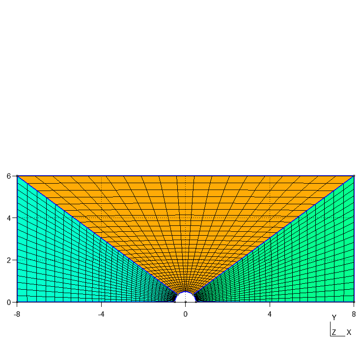
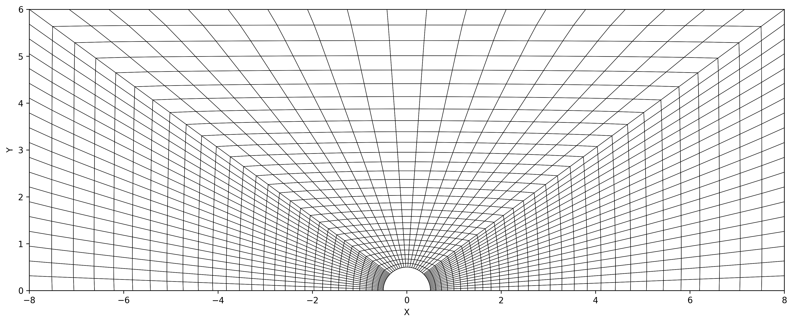

# Potential Flow Over a Cylinder Using FEM

This repository contains code to solve the potential flow over a cylinder using the Finite Element Method (FEM). The mesh is generated using the GMSH desktop application, and the calculations are performed based on the generated mesh and provided boundary conditions.

## Project Structure

- **`mesh.geo`**: GMSH geometry file used to define the cylinder geometry and generate the mesh.
- **`mesh.msh`**: Exported GMSH mesh file in `.msh` format, which contains nodes and elements used for FEM calculations.
- **`mesh.py`**: Contains the `Mesh` class. This script reads the GMSH mesh file, parses it, and plots the mesh for visualization and debugging purposes.

## Mesh Visualization

Below are the mesh images generated:

<div style="display: flex; justify-content: space-around;">
  <div style="text-align: center;">
    
    <p>GMSH Generated Mesh</p>
  </div>
  <div style="text-align: center;">
    
    <p>Python Generated Mesh</p>
  </div>
</div>

## How to Run

1. **Generate the Mesh**:  
   Open `mesh.geo` in the GMSH desktop application and generate the mesh. Once generated, export the mesh as a `.msh` file.

2. **Run the Code**:
   - Place the exported `mesh.msh` file in the same directory as `mesh.py`.
   - Run `mesh.py` to read and visualize the mesh.

3. **FEM Solver**:
   - [Add instructions about running the FEM solver script here, once implemented.]

## Dependencies

- Python 3.x
- Required packages: 
  - `numpy`
  - `pandas`
  - `matplotlib` (for plotting)

To install the dependencies, run:
```bash
pip install numpy pandas matplotlib
```

## Future Work
- Implement the FEM solver for potential flow around the cylinder.
- Validate the results against analytical solutions..